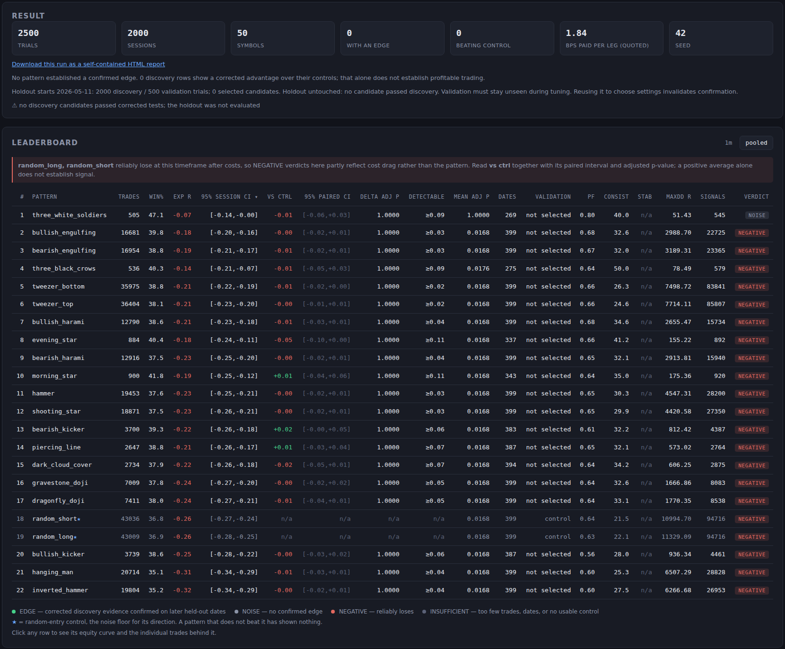
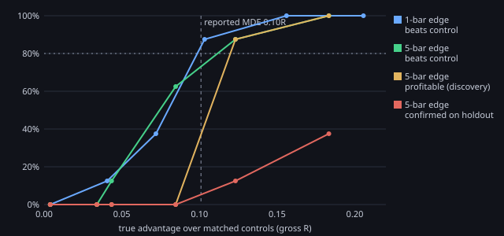
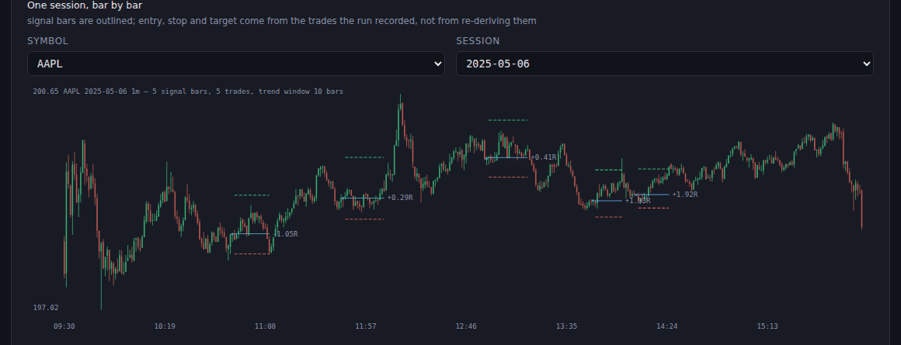

# candlebench

[](https://github.com/dpologdvinity/candlebench/actions/workflows/ci.yml)

[](LICENSE)

**Do classic candlestick patterns have a real intraday edge?** candlebench tests
66 patterns by turning every signal into a mechanical trade. It charges each
trade the spread quoted at that time of day, and compares the result with random
entries taken on the same days. A pattern counts only if it beats that control,
makes money after costs, and holds up on dates it was not chosen on.

**Live:** [interactive two-year results](https://dpologdvinity.github.io/candlebench/app/real/) ·
[interactive synthetic demo](https://dpologdvinity.github.io/candlebench/app/demo/) ·
[results site](https://dpologdvinity.github.io/candlebench/)



## The answer

The run covers two years of 1-minute bars (October 2024 to October 2026) for
100 liquid US stocks and ETFs: 5,000 sampled symbol-days on 505 market dates
and 1,014,018 pattern trades, charged an average quoted spread of **2.09 bps
per leg**. Two smaller runs (20 patterns, 50 symbols) came first, so the
multiple-comparison correction counts three experiments.

- **No pattern earns `EDGE`.** 60 of the 66 have 95% intervals entirely below
  zero after costs. The only row with positive expectancy after costs,
  `bearish_abandoned_baby`, has 17 trades.
- **No pattern beats random entry, even before costs.** Compared in gross R
  with its own stop-matched random entries, no row survives multiple-comparison
  correction.
- **Random entry itself loses about 0.30R per trade at 1m**, almost all of it
  spread. Before costs, the two controls sit at +0.007R and +0.010R.
- **"No edge" has a size.** Each row reports the smallest advantage its test
  would catch 80% of the time. For the 19 patterns with over 20,000 trades that
  is 0.018R to 0.032R, so an advantage over random entry larger than that would
  very likely have been found. Rare patterns report 0.08R or more; the rarest
  (abandoned babies, breakaways) trade too seldom to measure.
- **The same holds at 5, 15 and 60 minutes.** A second run over the same two
  years and 100 symbols sampled 5,000 symbol-days per timeframe (226,679
  pattern trades, 1.92 bps per leg). No pattern beats its matched controls at
  any of the three. Random entry loses 0.16R to 0.23R net there, less than at
  1m because the spread is a smaller share of a wider stop. At 5m the tweezers
  would reveal an advantage of 0.05R; at 1h, trades are too few to rule out
  less than about 0.2R. [Interactive](https://dpologdvinity.github.io/candlebench/app/intervals/) ·
  [report](https://dpologdvinity.github.io/candlebench/two-year-5m-15m-1h.html).

An earlier version of this project reported that eight patterns beat random
entry on signal alone and lost only to costs. That came from a measurement bias
the project later found in its own method; the next section explains it.

## How it is checked

The method has to find nothing where nothing exists. `candlebench.synthetic`
generates a random walk that no pattern can predict, and
[a calibration run](docs/experiments/null-calibration.md) counts how often each
test passes on it anyway.

It exposed two real flaws, and both are fixed:

1. **Net R rewards wide stops.** Costs are a fixed number of bps, and R divides
   by the distance to the stop, so a pattern with a wider stop pays fewer R for
   the same spread. Compared with random entry in net R, wide-stop patterns
   "won" with no signal at all: 38 of 800 rows across ten seeds, at least one in
   every run.
2. **A control with a different stop is not a fair control.** Even before
   costs, a tighter stop is caught more often by the rule that a bar touching
   both levels is a stop. Each pattern trade is now compared with its own
   matched control. The control has the same direction and stop distance and
   the same exit code, and enters on a random bar one to five bars later.
   Entering *earlier* turned out to be a trap: those bars were selected by the
   pattern itself, and a control placed five bars before a tweezer top lost
   0.56R on pure noise.

With both fixes, 1 row in 800 passes on the random walk, in 1 run of 10, which
is what a 5% familywise error rate predicts. Profitability is still tested net
of costs.

Finding nothing in noise is half the check; a method that never finds anything
passes it too. [The power study](docs/experiments/detection-power.md) plants
edges of known size in independent synthetic markets and runs the real-data
design over them. An advantage of 0.10R was caught 88% of the time, which
confirms the detection limit each row reports. It also shows that making money
needs a gross edge near 0.29R, and that the 20% holdout confirms only large
edges.



Other safeguards:

| Concern | What the code does |
| --- | --- |
| Lucky draws | Every pattern trade is paired with a random-entry control in the same session, with the same direction and stop distance. Matched-rate random-entry rows show what random entry loses at each timeframe. |
| Correlated trades | Bootstrap intervals resample whole market dates, not individual trades. |
| Many comparisons | Holm correction across every row and timeframe, plus a declared-experiment multiplier. A run warns when bootstrap resolution makes passing impossible. |
| Overfitting | The newest 20% of dates are held out. Only discovery candidates are tested on them, and `EDGE` needs both samples. |
| Flattering fills | Entry is on the next bar. A bar touching both stop and target counts as a stop unless it opened past the target. Gaps fill at the open. |
| Optimistic costs | The quoted model samples NBBO spreads per symbol and time of day, because the open runs about 4x midday. Borrowed buckets and estimates are reported separately from observed ones. |
| Tiny samples | A verdict needs at least 30 trades and 10 independent dates; a 3-trade "+0.95R" stays `INSUFFICIENT`. |

## Quick start

The demo needs no API key or download:

```bash
python -m venv .venv && source .venv/bin/activate
pip install -e .
candlebench demo          # synthetic market -> full run -> dashboard on :8765
```

The demo generates eight symbols of synthetic 1m bars and runs every pattern at
three timeframes in a few seconds. It then opens the dashboard on that run.
Every leaderboard row drills down to its equity curve, its per-symbol and
time-of-day breakdowns, and each session's chart with the trades drawn on it.



### Sharing a result

```bash
candlebench report out.json           # out.html: one self-contained file, no scripts
candlebench site out.json --out app/  # the interactive dashboard as static files
docker build -t candlebench-demo .    # or served live and read-only
docker run --rm -p 8765:8765 candlebench-demo
```

`candlebench site` exports the full dashboard for one run as plain files, so
any static host serves it with no server. A browser test sends every query to
the live server and to the exported copy and requires identical answers.
A report holds the summary, a leaderboard per timeframe, and a drill-down for
every pattern. Trades appear only as R multiples and dates, never as prices, so
a report built from licensed market data can be published. The dashboard can
download any saved run as a report. `serve --read-only` shows saved runs but
refuses to start work, and only a read-only server will listen beyond loopback.
The [results site](https://dpologdvinity.github.io/candlebench/) is rebuilt
by CI on every push.

### With real market data

Two years of intraday history come from Alpaca's free market-data API. Yahoo
Finance needs no key but serves only about a month. Keys are read from the
environment only, never from a config file or the browser.

```bash
export ALPACA_API_KEY=... ALPACA_SECRET_KEY=...
# in config/backtest.toml: source = "alpaca", and model = "quoted" for real spreads
candlebench fetch                     # download and cache bars
candlebench quotes --sessions 4       # sample NBBO spreads into a table
candlebench run -v --json out.json    # terminal leaderboard; trades go to out.parquet
candlebench serve                     # dashboard
```

A 200-trial run over two years of 1m bars takes about 20 seconds and peaks under
1 GiB of memory; the published 5,000-trial run over 100 symbols and 66 patterns
took 7.7 minutes on one core and peaked at 3.8 GiB. Its trade file is 40 MB, so
the published trade files sit on the
[data release](https://github.com/dpologdvinity/candlebench/releases/tag/data-2026-10-08)
rather than in git; `docs/results/` keeps the JSON summaries.

## Engineering

- **Over 690 tests**, including 27 headless-Chromium tests. CI runs
  them on Python 3.11 and 3.12, along with Pylint and a clean-environment wheel
  install.
- **Every run says what produced it.** Reports carry the git commit, package
  versions, a hash of the effective config, and a content hash of every cached
  file the run read, so two runs that disagree can be told apart.
- **Browser input is untrusted.** Every field is type-, range- and path-checked
  before it reaches a file path or a DataFrame. Malformed requests get a 400 or
  404 with a reason, never a traceback.
- **Nothing half-written is ever published.** Bar caches, trade files and run
  reports are written to a temporary file and renamed. A run becomes the latest
  only after its report, trades and archive copy are all saved. An incomplete
  refresh keeps the cached history rather than shortening it.
- **Unavailable is never zero.** A missing statistic is `None` and is shown as
  `n/a`. A cost that was estimated is never labelled observed.
- **Standard-library web server, no frontend build.** The dashboard is one
  dependency-free page with hand-drawn SVG charts. CI also builds the demo
  container and checks that it serves read-only.

```
candlebench/
  bars.py  alpaca.py  ticks.py  synthetic.py   data sources, validation, Parquet cache
  quotes.py  costs.py                          observed spreads and the fallback estimator
  patterns/                                    20 detectors and the random controls
  sampling.py  engine.py  runner.py            paired trials -> trades -> results
  metrics.py  leaderboard.py                   clustered bootstrap, Holm, detection limits, verdicts
  report.py  site.py                           shareable HTML report, static interactive export
  web/                                         loopback server, dashboard, run history
scripts/null_calibration.py                    false-positive check on a random walk
scripts/detection_power.py                     power curve from planted edges
```

## Documentation

- [Guide](docs/guide.md): commands, the trade and cost models, reading the
  leaderboard, configuration, data sources and historical measurements.
- Experiment reports: [null calibration](docs/experiments/null-calibration.md),
  [detection power](docs/experiments/detection-power.md),
  [matched-control entry window](docs/experiments/matched-window.md),
  [robustness to clustered volatility and rare patterns](docs/experiments/robustness.md),
  [trade-management sweep](docs/experiments/trade-management-sweep.md) and
  [stop-buffer sweep](docs/experiments/stop-buffer-sweep.md).
- [Data and cost measurements](docs/hft-data-and-costs.md).
- [`stock.py`](docs/stock-py.md): a separate companion script that scores one
  ticker for long-term, swing and day trading from current fundamentals and
  technicals. It shares no code with candlebench.

## Limits

This measures 66 textbook patterns under one mechanical trade rule: a stop at
the pattern's extreme, a fixed reward multiple and a holding cap. It does not
show that no candlestick-based strategy could work. The universe is 100 liquid
stocks and ETFs that exist today, so it carries survivorship bias. Quotes are
sampled, not complete, and the tested history covers two years. Read the
guide's caveats before relying on any number here.

MIT licensed.
